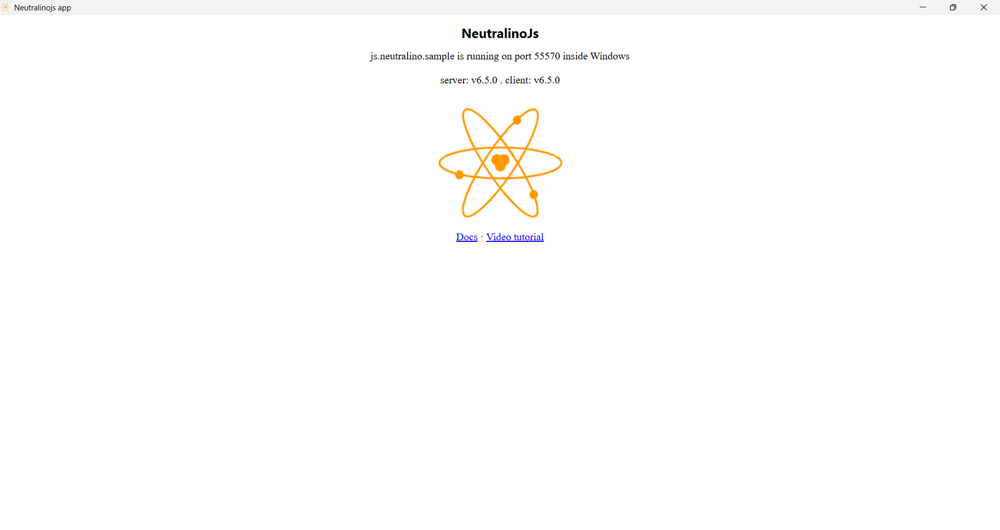

# neutralinojs-minimal

[](https://github.com/neutralinojs/neutralinojs-minimal/stargazers)
[](LICENSE)
[](https://neutralino.js.org)
[](https://summerofcode.withgoogle.com)

> The default minimal template for building cross-platform desktop apps with [Neutralinojs](https://neutralino.js.org) — a lightweight alternative to Electron, using your system's native browser.

---

## 📸 Preview



---

## ✨ Features

- ⚡ Lightweight — no bundled browser, uses system's native WebView
- 🌐 Build with plain HTML, CSS, and JavaScript
- 🔌 Supports any frontend framework (React, Vue, Svelte, etc.)
- 🖥️ Cross-platform — Windows, macOS, Linux

---

## 🚀 Getting Started

### Prerequisites

- [Node.js](https://nodejs.org/) **v18 or higher** (LTS recommended)
- [Neutralinojs CLI](https://neutralino.js.org/docs/cli/neu-cli) (v12.x or higher)

### Installation

**1. Install Neutralinojs CLI globally:**

```bash
npm install -g @neutralinojs/neu
```

**2. Clone the repository:**

```bash
git clone https://github.com/neutralinojs/neutralinojs-minimal.git
cd neutralinojs-minimal
```

**3. Run the application:**

```bash
neu run
```

The app will launch in a native desktop window. 🎉

---

## 🛠️ Project Structure

```
neutralinojs-minimal/
├── resources/          # UI files — HTML, CSS, JavaScript
│   └── index.html
├── neutralino.config.json  # App configuration
└── .github/            # GitHub Actions workflows
```

---

## 🧩 Using a Frontend Framework

You can integrate React, Vue, Svelte, or any other frontend framework.  
Follow the official guide: [Using Frontend Libraries](https://neutralino.js.org/docs/getting-started/using-frontend-libraries)

---

## 🐛 Troubleshooting

| Problem | Solution |
|---|---|
| `neu: command not found` | Make sure you ran `npm install -g @neutralinojs/neu` and npm's global bin is in your PATH |
| App window does not open | Check if your OS allows WebView access; try updating `neutralino.config.json` |
| Port conflict errors | Change the `port` value in `neutralino.config.json` |

For more help, visit the [Neutralinojs Discussions](https://github.com/neutralinojs/neutralinojs/discussions).

---

## 🤝 Contributing

Contributions are welcome! Here's how to get started:

1. Fork the repository
2. Create a new branch: `git checkout -b feature/your-feature-name`
3. Make your changes
4. Commit with a clear message: `git commit -m "feat: describe your change"`
5. Push and open a Pull Request

Please follow the existing code style and keep PRs focused and small.

---

## 👥 Contributors

[](https://github.com/neutralinojs/neutralinojs-minimal/graphs/contributors)

---

## 🔗 Related

- [Neutralinojs Main Repo](https://github.com/neutralinojs/neutralinojs)
- [Official Documentation](https://neutralino.js.org/docs)
- [GSoC with Neutralinojs](https://neutralino.js.org/docs/contributing/gsoc)

---

## 📄 License

[MIT](LICENSE)

---

## 🎨 Icon Credits

- `trayIcon.png` — Made by [Freepik](https://www.freepik.com), downloaded from [Flaticon](https://www.flaticon.com)
